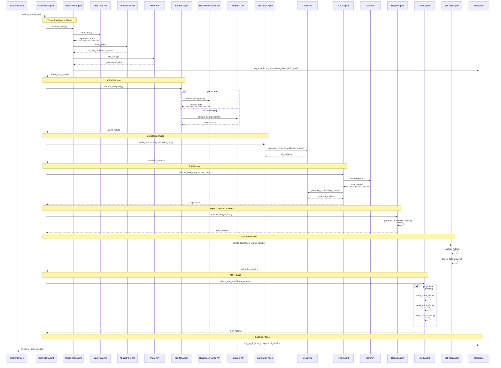

# 🛡️ CyberSecurity Multi-Agent System - Complete Visualization

This document provides comprehensive visualizations of the CyberSecurity Multi-Agent System architecture, workflows, and data flows.

## 📋 Table of Contents
- [🛡️ CyberSecurity Multi-Agent System - Complete Visualization](#️-cybersecurity-multi-agent-system---complete-visualization)
  - [📋 Table of Contents](#-table-of-contents)
  - [1. System Architecture Overview](#1-system-architecture-overview)
  - [2. Agent Workflow](#2-agent-workflow)
  - [3. Data Flow Diagram](#3-data-flow-diagram)
  - [4. Agent Communication Protocol (A2A)](#4-agent-communication-protocol-a2a)
  - [5. Class Diagram](#5-class-diagram)
  - [6. Sequence Diagram - Complete Scan Process](#6-sequence-diagram---complete-scan-process)
  - [7. Database Schema](#7-database-schema)
  - [8. Deployment Architecture](#8-deployment-architecture)
  - [9. Alert System Flow](#9-alert-system-flow)
  - [10. Technology Stack Visualization](#10-technology-stack-visualization)
  - [🚀 Getting Started](#-getting-started)
  - [📚 Diagram Legend](#-diagram-legend)

---

## 1. System Architecture Overview


---

## 2. Agent Workflow


---

## 3. Data Flow Diagram

```mermaid
graph LR
    subgraph "Input Layer"
        INPUT[User Query<br/>IP/Email/Domain]
    end
    
    subgraph "Processing Layer"
        THREAT[Threat Intelligence<br/>• VirusTotal<br/>• AbuseIPDB<br/>• IPInfo]
        OSINT[OSINT Data<br/>• HaveIBeenPwned<br/>• Hunter.io]
        AI[AI Analysis<br/>• Correlation<br/>• RAG Search<br/>• Gemini AI]
    end
    
    subgraph "Analysis Layer"
        CORR[Correlation Analysis<br/>Cross-reference data<br/>Risk assessment]
        RAG_PROC[RAG Processing<br/>Web search context<br/>Real-time intel]
    end
    
    subgraph "Output Layer"
        REPORT[Security Report<br/>Markdown format<br/>Timestamped]
        ALERTS[Alert System<br/>Email, Slack, Discord<br/>Risk-based triggers]
        LOGS[Database Logs<br/>Audit trail<br/>Historical data]
    end
    
    subgraph "Validation Layer"
        TEST[Self-Testing<br/>Data validation<br/>Quality assurance]
    end
    
    INPUT --> THREAT
    INPUT --> OSINT
    
    THREAT --> CORR
    OSINT --> CORR
    
    THREAT --> RAG_PROC
    CORR --> AI
    RAG_PROC --> AI
    
    THREAT --> REPORT
    OSINT --> REPORT
    AI --> REPORT
    
    THREAT --> ALERTS
    AI --> ALERTS
    
    THREAT --> TEST
    
    THREAT --> LOGS
    OSINT --> LOGS
    AI --> LOGS
    REPORT --> LOGS
    ALERTS --> LOGS
    TEST --> LOGS
    
    classDef input fill:#e8f5e8,stroke:#2e7d32,stroke-width:3px
    classDef processing fill:#e3f2fd,stroke:#1976d2,stroke-width:2px
    classDef analysis fill:#fff3e0,stroke:#f57c00,stroke-width:2px
    classDef output fill:#fce4ec,stroke:#c2185b,stroke-width:2px
    classDef validation fill:#f3e5f5,stroke:#7b1fa2,stroke-width:2px
    
    class INPUT input
    class THREAT,OSINT processing
    class CORR,RAG_PROC,AI analysis
    class REPORT,ALERTS,LOGS output
    class TEST validation
```



---

## 4. Agent Communication Protocol (A2A)


---

## 5. Class Diagram


---

## 6. Sequence Diagram - Complete Scan Process



---

## 7. Database Schema


---

## 8. Deployment Architecture

```mermaid
graph TB
    subgraph "Client Layer"
        WEB[Web Browser]
        API_CLIENT[API Client]
    end
    
    subgraph "Application Layer"
        STREAMLIT[Streamlit Dashboard<br/>Port 8501]
        FASTAPI[FastAPI Server<br/>Port 8000]
    end
    
    subgraph "Core Processing"
        CONTROLLER[Controller Agent]
        AGENTS[Agent Pool<br/>• ThreatIntel<br/>• OSINT<br/>• Correlation<br/>• RAG<br/>• Report<br/>• Alert<br/>• SelfTest]
    end
    
    subgraph "Data Layer"
        SQLITE[(SQLite Database<br/>logs.db)]
        FILES[File System<br/>Reports & Logs]
    end
    
    subgraph "External Services"
        THREAT_APIS[Threat Intel APIs<br/>• VirusTotal<br/>• AbuseIPDB<br/>• IPInfo]
        OSINT_APIS[OSINT APIs<br/>• HaveIBeenPwned<br/>• Hunter.io]
        AI_SERVICES[AI Services<br/>• Google Gemini<br/>• SerpAPI]
        ALERT_SERVICES[Alert Services<br/>• SMTP Email<br/>• Slack Webhook<br/>• Discord Webhook]
    end
    
    WEB --> STREAMLIT
    API_CLIENT --> FASTAPI
    
    STREAMLIT --> CONTROLLER
    FASTAPI --> CONTROLLER
    
    CONTROLLER --> AGENTS
    
    AGENTS --> SQLITE
    AGENTS --> FILES
    
    AGENTS --> THREAT_APIS
    AGENTS --> OSINT_APIS
    AGENTS --> AI_SERVICES
    AGENTS --> ALERT_SERVICES
    
    classDef client fill:#e1f5fe,stroke:#01579b,stroke-width:2px
    classDef app fill:#f3e5f5,stroke:#4a148c,stroke-width:2px
    classDef core fill:#e8f5e8,stroke:#1b5e20,stroke-width:2px
    classDef data fill:#fff3e0,stroke:#e65100,stroke-width:2px
    classDef external fill:#ffebee,stroke:#b71c1c,stroke-width:2px
    
    class WEB,API_CLIENT client
    class STREAMLIT,FASTAPI app
    class CONTROLLER,AGENTS core
    class SQLITE,FILES data
    class THREAT_APIS,OSINT_APIS,AI_SERVICES,ALERT_SERVICES external
```



---

## 9. Alert System Flow


---

## 10. Technology Stack Visualization


---

## 🚀 Getting Started

To visualize these diagrams in your development environment:

1. **Install Mermaid CLI** (optional for PNG/SVG export):
   ```bash
   npm install -g @mermaid-js/mermaid-cli
   ```

2. **Use Mermaid Live Editor**: https://mermaid.live/

3. **VS Code Extension**: Install "Mermaid Markdown Syntax Highlighting"

4. **GitHub/GitLab**: These diagrams render automatically in markdown files

---

## 📚 Diagram Legend

- **Blue**: User interfaces and entry points
- **Purple**: Core system components
- **Green**: Processing agents and AI components
- **Orange**: External APIs and services
- **Red**: Alert and notification systems
- **Teal**: Database and storage components

---

*This visualization document is automatically updated with the system architecture. Last updated: June 25, 2025*
