# 🔒 Security Guide for Security Multi-Agent System

This document provides comprehensive security guidelines, best practices, and hardening instructions for deploying and maintaining the Security Multi-Agent System.

## 📋 Table of Contents

- [🛡️ Security Overview](#️-security-overview)
- [🔍 Vulnerability Management](#-vulnerability-management)
- [🐳 Container Security](#-container-security)
- [🌐 Network Security](#-network-security)
- [🔐 Secrets Management](#-secrets-management)
- [📊 Security Monitoring](#-security-monitoring)
- [🚨 Incident Response](#-incident-response)
- [✅ Security Checklist](#-security-checklist)
- [🔧 Hardening Guide](#-hardening-guide)

---

## 🛡️ Security Overview

The Security Multi-Agent System implements multiple layers of security controls to protect against various threat vectors:

### 🎯 **Security Objectives**

- **Confidentiality**: Protect sensitive data and API keys
- **Integrity**: Ensure data and system integrity
- **Availability**: Maintain system availability and resilience
- **Accountability**: Comprehensive audit trail and logging
- **Compliance**: Meet security standards and regulations

### 🏗️ **Security Architecture**

```mermaid
graph TB
    subgraph "External Layer"
        WAF[🛡️ Web Application Firewall]
        LB[⚖️ Load Balancer/Nginx]
    end
    
    subgraph "Application Layer"
        API[🚀 FastAPI]
        DASH[📊 Streamlit]
        WORKER[⚙️ Workers]
    end
    
    subgraph "Data Layer"
        DB[(🗄️ PostgreSQL)]
        REDIS[(📦 Redis)]
        SECRETS[🔐 Secrets Store]
    end
    
    subgraph "Security Controls"
        SCAN[🔍 Vulnerability Scanner]
        LOG[📝 Security Logging]
        MON[📊 Security Monitoring]
        BACKUP[💾 Secure Backups]
    end
    
    WAF --> LB
    LB --> API & DASH
    API --> WORKER
    WORKER --> DB & REDIS
    API --> SECRETS
    
    SCAN --> API & DASH & WORKER
    LOG --> API & DASH & WORKER
    MON --> API & DASH & WORKER & DB
    BACKUP --> DB
```



---

## 🔍 Vulnerability Management

### 🚨 **Automated Vulnerability Scanning**

#### **Docker Security Scanning**

```bash
# Run comprehensive security scan
./security-scan.sh        # Linux/macOS
security-scan.bat          # Windows

# Scan results location
ls -la security-scan-results/
├── security-summary.md           # Comprehensive report
├── trivy-vulnerabilities.json    # Detailed vulnerabilities
├── trivy-secrets.json           # Secret scanning results
├── scout-cves.sarif             # Docker Scout results
└── grype-report.txt             # Grype vulnerability report
```

#### **Continuous Vulnerability Monitoring**

```yaml
# .github/workflows/security-scan.yml
name: Security Scan
on:
  push:
    branches: [main]
  pull_request:
    branches: [main]
  schedule:
    - cron: '0 2 * * *'  # Daily at 2 AM

jobs:
  security-scan:
    runs-on: ubuntu-latest
    steps:
      - uses: actions/checkout@v3
      
      - name: Run Trivy vulnerability scanner
        uses: aquasecurity/trivy-action@master
        with:
          image-ref: 'security-agents/multi-agent:latest'
          format: 'sarif'
          output: 'trivy-results.sarif'
      
      - name: Upload Trivy scan results
        uses: github/codeql-action/upload-sarif@v2
        with:
          sarif_file: 'trivy-results.sarif'
```

#### **Vulnerability Response Process**

1. **Detection**: Automated scanning identifies vulnerabilities
2. **Assessment**: Evaluate severity and exploitability
3. **Prioritization**: Risk-based prioritization (Critical > High > Medium > Low)
4. **Remediation**: Update base images, dependencies, or apply patches
5. **Verification**: Re-scan to confirm vulnerability resolution
6. **Documentation**: Update security documentation

### 📊 **Vulnerability Severity Levels**

| Severity | Response Time | Action Required |
|----------|---------------|-----------------|
| **Critical** | Immediate (< 4 hours) | Emergency patch/update |
| **High** | 24 hours | Scheduled update within 1 week |
| **Medium** | 1 week | Regular maintenance cycle |
| **Low** | 1 month | Next planned release |

---

## 🐳 Container Security

### 🔒 **Container Hardening**

#### **Secure Base Images**

```dockerfile
# Use minimal, regularly updated base images
FROM ubuntu:22.04 as production

# Apply security updates during build
RUN apt-get update && \
    apt-get upgrade -y && \
    apt-get install -y --no-install-recommends \
    # Only essential packages
    && apt-get autoremove -y \
    && apt-get clean \
    && rm -rf /var/lib/apt/lists/* \
    && rm -rf /tmp/* \
    && rm -rf /var/tmp/*
```

#### **Non-Root User Execution**

```dockerfile
# Create dedicated non-root user
RUN groupadd -r security --gid=1000 && \
    useradd -r -g security --uid=1000 --home-dir=/app --shell=/bin/bash security

# Set proper ownership and permissions
COPY --chown=security:security . .
RUN chmod -R 750 /app

# Switch to non-root user
USER security
```

#### **Security Context**

```yaml
# docker-compose.yml security configuration
services:
  api:
    security_opt:
      - no-new-privileges:true
    read_only: true
    tmpfs:
      - /tmp:noexec,nosuid,size=100m
    cap_drop:
      - ALL
    cap_add:
      - NET_BIND_SERVICE  # Only if binding to privileged ports
```

### 🛡️ **Runtime Security**

#### **Resource Limits**

```yaml
services:
  api:
    deploy:
      resources:
        limits:
          memory: 2G
          cpus: '1.0'
        reservations:
          memory: 1G
          cpus: '0.5'
    ulimits:
      nproc: 65535
      nofile:
        soft: 65535
        hard: 65535
```

#### **Health Checks**

```dockerfile
# Comprehensive health check
HEALTHCHECK --interval=30s --timeout=10s --start-period=40s --retries=3 \
    CMD curl -f http://localhost:8000/health || exit 1
```

---

## 🌐 Network Security

### 🔒 **Network Isolation**

#### **Docker Networks**

```yaml
# docker-compose.yml network configuration
networks:
  frontend:
    driver: bridge
    ipam:
      config:
        - subnet: 172.20.1.0/24
  backend:
    driver: bridge
    internal: true
    ipam:
      config:
        - subnet: 172.20.2.0/24
```

#### **Service Communication**

```yaml
services:
  nginx:
    networks:
      - frontend
  
  api:
    networks:
      - frontend
      - backend
  
  db:
    networks:
      - backend  # No external access
```

### 🛡️ **SSL/TLS Configuration**

#### **Nginx SSL Configuration**

```nginx
# nginx.conf SSL hardening
server {
    listen 443 ssl http2;
    
    # SSL Certificate
    ssl_certificate /etc/ssl/certs/nginx.crt;
    ssl_certificate_key /etc/ssl/private/nginx.key;
    
    # SSL Security
    ssl_protocols TLSv1.2 TLSv1.3;
    ssl_ciphers ECDHE-RSA-AES256-GCM-SHA512:DHE-RSA-AES256-GCM-SHA512:ECDHE-RSA-AES256-GCM-SHA384:DHE-RSA-AES256-GCM-SHA384;
    ssl_prefer_server_ciphers off;
    ssl_session_cache shared:SSL:10m;
    ssl_session_timeout 10m;
    
    # Security Headers
    add_header Strict-Transport-Security "max-age=31536000; includeSubDomains" always;
    add_header X-Content-Type-Options nosniff always;
    add_header X-Frame-Options DENY always;
    add_header X-XSS-Protection "1; mode=block" always;
    add_header Referrer-Policy "strict-origin-when-cross-origin" always;
    add_header Content-Security-Policy "default-src 'self'; script-src 'self' 'unsafe-inline'; style-src 'self' 'unsafe-inline'" always;
}
```

#### **Certificate Management**

```bash
# Generate self-signed certificate (development)
openssl req -x509 -nodes -days 365 -newkey rsa:2048 \
    -keyout nginx/ssl/nginx.key \
    -out nginx/ssl/nginx.crt \
    -subj "/C=US/ST=State/L=City/O=Organization/CN=localhost"

# Let's Encrypt (production)
docker run --rm -v $(pwd)/nginx/ssl:/etc/letsencrypt \
    certbot/certbot certonly --standalone \
    -d yourdomain.com \
    --email your-email@domain.com \
    --agree-tos
```

---

## 🔐 Secrets Management

### 🗝️ **Environment Variables**

#### **Secure Environment Configuration**

```bash
# .env security guidelines
# Use strong, unique passwords
POSTGRES_PASSWORD=$(openssl rand -base64 32)
SECRET_KEY=$(openssl rand -base64 32)
REDIS_PASSWORD=$(openssl rand -base64 32)

# API keys should be properly scoped and rotated
VT_API_KEY=your_virustotal_api_key_here
GEMINI_API_KEY=your_google_gemini_api_key_here

# Enable security features
ENVIRONMENT=production
DEBUG=false
SECURE_COOKIES=true
SESSION_TIMEOUT_HOURS=1
```

#### **Docker Secrets (Production)**

```yaml
# docker-compose.yml with Docker secrets
version: '3.8'

secrets:
  postgres_password:
    external: true
  jwt_secret:
    external: true

services:
  db:
    environment:
      POSTGRES_PASSWORD_FILE: /run/secrets/postgres_password
    secrets:
      - postgres_password
  
  api:
    environment:
      JWT_SECRET_FILE: /run/secrets/jwt_secret
    secrets:
      - jwt_secret
```

```bash
# Create Docker secrets
echo "your_postgres_password" | docker secret create postgres_password -
echo "your_jwt_secret_key" | docker secret create jwt_secret -
```

### 🔄 **Key Rotation**

#### **Automated Key Rotation**

```python
# scripts/rotate_keys.py
import os
import secrets
import string
from datetime import datetime, timedelta

def generate_secure_key(length=32):
    """Generate cryptographically secure random key"""
    alphabet = string.ascii_letters + string.digits + "!@#$%^&*"
    return ''.join(secrets.choice(alphabet) for _ in range(length))

def rotate_jwt_secret():
    """Rotate JWT secret key"""
    new_secret = generate_secure_key(64)
    
    # Update environment file
    with open('.env', 'r') as f:
        content = f.read()
    
    # Replace old secret
    import re
    content = re.sub(r'SECRET_KEY=.*', f'SECRET_KEY={new_secret}', content)
    
    with open('.env', 'w') as f:
        f.write(content)
    
    # Log rotation
    with open('key_rotation.log', 'a') as f:
        f.write(f"{datetime.now().isoformat()}: JWT secret rotated\n")

if __name__ == "__main__":
    rotate_jwt_secret()
```

---

## 📊 Security Monitoring

### 📈 **Security Metrics**

#### **Prometheus Security Metrics**

```python
# Add to application code
from prometheus_client import Counter, Histogram, Gauge

# Security-related metrics
FAILED_LOGIN_ATTEMPTS = Counter('security_failed_logins_total', 'Failed login attempts')
API_REQUEST_DURATION = Histogram('security_api_request_duration_seconds', 'API request duration')
ACTIVE_SESSIONS = Gauge('security_active_sessions', 'Number of active user sessions')
SUSPICIOUS_ACTIVITY = Counter('security_suspicious_activity_total', 'Suspicious activity detected')

# Usage in application
@app.middleware("http")
async def security_monitoring(request: Request, call_next):
    start_time = time.time()
    
    response = await call_next(request)
    
    # Record metrics
    duration = time.time() - start_time
    API_REQUEST_DURATION.observe(duration)
    
    # Detect suspicious patterns
    if response.status_code == 401:
        FAILED_LOGIN_ATTEMPTS.inc()
    
    return response
```

#### **Grafana Security Dashboard**

```json
{
  "dashboard": {
    "title": "Security Monitoring",
    "panels": [
      {
        "title": "Failed Login Attempts",
        "type": "stat",
        "targets": [
          {
            "expr": "rate(security_failed_logins_total[5m])"
          }
        ]
      },
      {
        "title": "Suspicious Activity",
        "type": "graph",
        "targets": [
          {
            "expr": "security_suspicious_activity_total"
          }
        ]
      }
    ]
  }
}
```

### 🚨 **Security Alerting**

#### **Prometheus Alert Rules**

```yaml
# monitoring/security_alerts.yml
groups:
  - name: security
    rules:
      - alert: HighFailedLoginRate
        expr: rate(security_failed_logins_total[5m]) > 10
        for: 2m
        labels:
          severity: warning
        annotations:
          summary: "High rate of failed login attempts"
          description: "{{ $value }} failed login attempts per second"
      
      - alert: SuspiciousActivity
        expr: increase(security_suspicious_activity_total[10m]) > 50
        for: 1m
        labels:
          severity: critical
        annotations:
          summary: "Suspicious activity detected"
          description: "{{ $value }} suspicious events in the last 10 minutes"
      
      - alert: ContainerVulnerability
        expr: container_vulnerability_count{severity="critical"} > 0
        for: 0m
        labels:
          severity: critical
        annotations:
          summary: "Critical vulnerability detected in container"
          description: "Container {{ $labels.container }} has {{ $value }} critical vulnerabilities"
```

---

## 🚨 Incident Response

### 📋 **Incident Response Plan**

#### **Phase 1: Detection & Analysis**

1. **Automated Detection**
   - Monitor security alerts and metrics
   - Analyze log patterns and anomalies
   - Vulnerability scan results

2. **Manual Detection**
   - User reports
   - Security team observations
   - Third-party notifications

#### **Phase 2: Containment**

```bash
# Emergency containment procedures

# 1. Isolate affected containers
docker-compose stop <affected_service>

# 2. Preserve evidence
docker-compose logs <affected_service> > incident_logs_$(date +%Y%m%d_%H%M%S).log

# 3. Create forensic copy
docker commit <container_id> forensic_image_$(date +%Y%m%d_%H%M%S)

# 4. Block suspicious traffic (if applicable)
# Update firewall rules or nginx configuration
```

#### **Phase 3: Investigation**

```bash
# Investigate container compromise
docker run -it --rm -v /var/run/docker.sock:/var/run/docker.sock \
    security-forensics:latest investigate <container_id>

# Analyze logs for indicators of compromise
grep -i "error\|fail\|attack\|intrusion" incident_logs_*.log

# Check for file integrity violations
docker diff <container_id>
```

#### **Phase 4: Recovery**

```bash
# Recovery procedures

# 1. Stop all services
docker-compose down

# 2. Restore from clean backup
./deploy.sh restore

# 3. Apply security patches
docker-compose pull
./security-scan.sh

# 4. Restart with enhanced monitoring
docker-compose up -d
```

### 📞 **Emergency Contacts**

| Role | Contact | Escalation Time |
|------|---------|-----------------|
| Security Team Lead | security-lead@company.com | Immediate |
| DevOps Engineer | devops@company.com | 15 minutes |
| System Administrator | sysadmin@company.com | 30 minutes |
| Management | management@company.com | 1 hour |

---

## ✅ Security Checklist

### 🚀 **Pre-Deployment Security Checklist**

- [ ] **Environment Configuration**
  - [ ] All default passwords changed
  - [ ] API keys properly configured
  - [ ] Debug mode disabled in production
  - [ ] Strong JWT secret key set
  
- [ ] **Container Security**
  - [ ] Running as non-root user
  - [ ] Security scan passed (no critical/high vulnerabilities)
  - [ ] Resource limits configured
  - [ ] Health checks enabled
  
- [ ] **Network Security**
  - [ ] SSL/TLS configured
  - [ ] Security headers enabled
  - [ ] Unnecessary ports closed
  - [ ] Network segmentation implemented
  
- [ ] **Data Protection**
  - [ ] Database encryption enabled
  - [ ] Backup encryption configured
  - [ ] Secrets properly managed
  - [ ] Data retention policies set

### 🔄 **Ongoing Security Checklist**

#### **Daily**
- [ ] Review security alerts and metrics
- [ ] Check for failed authentication attempts
- [ ] Monitor resource usage anomalies
- [ ] Verify backup completion

#### **Weekly**
- [ ] Run vulnerability scans
- [ ] Review access logs
- [ ] Update threat intelligence feeds
- [ ] Test incident response procedures

#### **Monthly**
- [ ] Rotate API keys and passwords
- [ ] Update base images and dependencies
- [ ] Review and update security policies
- [ ] Conduct security training

#### **Quarterly**
- [ ] Penetration testing
- [ ] Security architecture review
- [ ] Disaster recovery testing
- [ ] Compliance audit

---

## 🔧 Hardening Guide

### 🛡️ **System Hardening**

#### **Docker Daemon Security**

```json
// /etc/docker/daemon.json
{
  "live-restore": true,
  "userland-proxy": false,
  "no-new-privileges": true,
  "log-driver": "json-file",
  "log-opts": {
    "max-size": "10m",
    "max-file": "3"
  },
  "storage-driver": "overlay2",
  "experimental": false,
  "debug": false
}
```

#### **Host Security**

```bash
# Firewall configuration (Ubuntu/Debian)
ufw enable
ufw default deny incoming
ufw default allow outgoing
ufw allow ssh
ufw allow 80/tcp
ufw allow 443/tcp

# Disable unnecessary services
systemctl disable bluetooth
systemctl disable cups
systemctl disable avahi-daemon

# Enable automatic security updates
apt-get install unattended-upgrades
dpkg-reconfigure unattended-upgrades
```

### 🔐 **Application Hardening**

#### **FastAPI Security Configuration**

```python
# fastapi_app/security.py
from fastapi import FastAPI, Security, HTTPException
from fastapi.security import HTTPBearer, HTTPAuthorizationCredentials
from fastapi.middleware.cors import CORSMiddleware
from fastapi.middleware.trustedhost import TrustedHostMiddleware
import secrets

app = FastAPI()

# Security middleware
app.add_middleware(
    TrustedHostMiddleware, 
    allowed_hosts=["yourdomain.com", "localhost"]
)

app.add_middleware(
    CORSMiddleware,
    allow_origins=["https://yourdomain.com"],
    allow_credentials=True,
    allow_methods=["GET", "POST"],
    allow_headers=["*"],
)

# Security headers
@app.middleware("http")
async def add_security_headers(request, call_next):
    response = await call_next(request)
    response.headers["X-Content-Type-Options"] = "nosniff"
    response.headers["X-Frame-Options"] = "DENY"
    response.headers["X-XSS-Protection"] = "1; mode=block"
    response.headers["Strict-Transport-Security"] = "max-age=31536000; includeSubDomains"
    return response

# Rate limiting
from slowapi import Limiter, _rate_limit_exceeded_handler
from slowapi.util import get_remote_address
from slowapi.errors import RateLimitExceeded

limiter = Limiter(key_func=get_remote_address)
app.state.limiter = limiter
app.add_exception_handler(RateLimitExceeded, _rate_limit_exceeded_handler)

@app.get("/api/scan")
@limiter.limit("10/minute")
async def scan_endpoint(request: Request):
    # API implementation
    pass
```

### 📊 **Database Security**

#### **PostgreSQL Hardening**

```bash
# postgresql.conf security settings
ssl = on
ssl_cert_file = 'server.crt'
ssl_key_file = 'server.key'
ssl_ciphers = 'ECDHE-RSA-AES256-GCM-SHA384:ECDHE-RSA-AES128-GCM-SHA256'
ssl_prefer_server_ciphers = on

log_statement = 'all'
log_min_duration_statement = 1000
log_connections = on
log_disconnections = on
log_checkpoints = on

# Connection limits
max_connections = 100
superuser_reserved_connections = 3
```

```sql
-- Database security configuration
-- Create dedicated application user
CREATE USER security_app WITH PASSWORD 'strong_random_password';

-- Grant minimal required privileges
GRANT CONNECT ON DATABASE security_agents TO security_app;
GRANT USAGE ON SCHEMA public TO security_app;
GRANT SELECT, INSERT, UPDATE, DELETE ON ALL TABLES IN SCHEMA public TO security_app;

-- Enable row-level security
ALTER TABLE scan_results ENABLE ROW LEVEL SECURITY;
CREATE POLICY scan_results_policy ON scan_results
    FOR ALL TO security_app
    USING (user_id = current_user_id());

-- Audit trail
CREATE TABLE audit_log (
    id SERIAL PRIMARY KEY,
    table_name VARCHAR(50),
    operation VARCHAR(10),
    old_values JSONB,
    new_values JSONB,
    user_name VARCHAR(50),
    timestamp TIMESTAMP DEFAULT CURRENT_TIMESTAMP
);
```

---

## 📚 Additional Resources

### 🔗 **Security References**

- [OWASP Container Security](https://owasp.org/www-project-container-security/)
- [CIS Docker Benchmark](https://www.cisecurity.org/benchmark/docker)
- [NIST Cybersecurity Framework](https://www.nist.gov/cyberframework)
- [Docker Security Best Practices](https://docs.docker.com/engine/security/)

### 🛠️ **Security Tools**

- **Vulnerability Scanners**: Trivy, Grype, Docker Scout, Clair
- **Security Monitoring**: Falco, OSSEC, Wazuh
- **Network Security**: ModSecurity, Suricata, Zeek
- **Secrets Management**: HashiCorp Vault, Docker Secrets, AWS Secrets Manager

### 📞 **Support**

For security-related questions or to report vulnerabilities:
- Email: security@yourdomain.com
- Security Portal: https://security.yourdomain.com
- Emergency Hotline: +1-XXX-XXX-XXXX

---

**Remember**: Security is an ongoing process, not a one-time setup. Regularly review and update your security measures to stay ahead of emerging threats.
